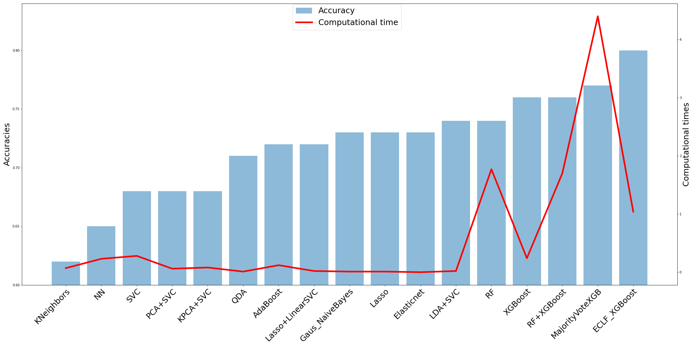

# Machine-Learning-for-medical-data

This was a project within a course from the Sorbonne University, Paris.  

We examined the [Cirrhosis dataset](https://www.kaggle.com/fedesoriano/cirrhosis-prediction-dataset)
by applying appropriate ML-models on it. The results are presented in the [beamer presentation](projetMedicalSlides.pdf).  
In the end we compared accuracy and training time for each model and visualized this in the following plot: 

